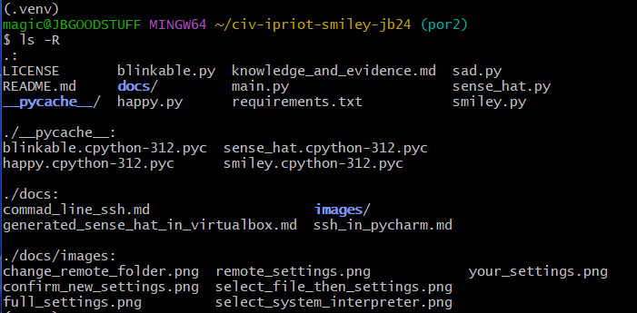

<style>

body {
    counter-reset: h2counter;
}

/* H1 - No numbering */
h1 {
    /* No counter reset or increment */
}

/* H2 - Level 1 numbering */
h2 {
    counter-reset: h3counter;
}

h2::before {
    counter-increment: h2counter;
    content: counter(h2counter) ". ";
}

/* H3 - Level 2 numbering */
h3 {
    counter-reset: h4counter;
}

h3::before {
    counter-increment: h3counter;
    content: counter(h2counter) "." counter(h3counter) " ";
}

/* H4 - Level 3 numbering (optional) */
h4 {
    counter-reset: h5counter;
}

h4::before {
    counter-increment: h4counter;
    content: counter(h2counter) "." counter(h3counter) "." counter(h4counter) " ";
}

</style>

# Evidence and Knowledge

This document includes instructions and knowledge questions that must be completed to receive a *Competent* grade on this portfolio task.

## Required evidence

### Answer all questions in this document

- Each answer should be complete, well-articulated, and within the specified word count limits (if added) for each question.
- Please make sure **all** external sources are properly cited.
- You must **use your own words**. Please include your full chat transcripts if you use generative AI in any way.
- Generative AI hallucinates, is not an authoritative source

### Make all the required modifications to the code

- Please follow the instructions in this document to make the changes needed to the code.

- When requested to upload evidence, upload all screenshots to `screenshots/` and embed them in this document. For example:

```
markdown

```

- You must upload the code into your GitHub repository.
- While you can use a branch, your code should be in main when you submit.
- Upload a zip of this repository to Blackboard when you are ready to submit.
- You will be notified of your result via Blackboard
- However, if using GitHub classrooms, you may also receive additional feedback on GitHub directly

### Optional: Use of Raspberry Pi and SenseHat

Raspberry Pi or SenseHat is **optional** for this activity. You can use the included `sense_hat.py` file to simulate the SenseHat on your computer.

If you use a Pi, please **delete** the `sense_hat.py` file.

### Accessible version of the code

This project relies on visual patterns that appear on an LED matrix. If you have any accessibility requirements, you can use the `udl/accessible` branch to complete the project. This branch provides an accessible code version that uses text-based patterns instead of visual ones.

Please discuss this with your lecturer before using that branch.

## Specific Tasks & Questions

Address the following tasks and questions based on the code provided in this repository.

### Set up the project locally

1. Fork this repository (if not using GitHub Classrooms)
2. Clone your repository locally
3. Run the project locally by executing the `main.py` file
4. Evidence this by providing screenshots of the project directory structure and the output of the `main.py` file




If you are running on a Raspberry Pi, you can use the following command to run the project and then screenshot the result:

```bash
ls
python3 main.py
```

### Fundamental code comprehension

Answer each of the following questions **as they relate to that code** supplied by in this repository (ignore `sense_hat.py`):

1. Examine the code for the `smiley.py` file and provide  an example of a variable of each of the following types and their corresponding values (`_` should be replaced with the appropriate values):

   | Type                    | name   | value                                                   |
   |-------------------------|--------|---------------------------------------------------------|
   | built-in primitive type | dimmed | True                                                    |
   | built-in composite type | GREEN  | (0, 255, 0)                                             |
   | user-defined type       | Smiley | WHITE, GREEN, RED, YELLOW, BLANK, dim_display(), show() |

2. Fill in (`_`) the following table based on the code in `smiley.py`:

   | Object                  | Type   |
   |-------------------------|--------|
   | self.pixels             | list   |
   | A member of self.pixels | Y      |
   | self                    | Smiley |

3. Examine the code for `smiley.py`, `sad.py`, and `happy.py`. Give an example of each of the following control structures using an example from **each** of these files. Include the first line and the line range:

   | Control Flow | File      | First line                               | Line range |
   |--------------|-----------|------------------------------------------|------------|
   | sequence     | smiley.py | WHITE = (255, 255, 255)                  | 5-40       |
   | selection    | happy.py  | self.BLANK if wide_open else self.YELLOW | 31         |
   | iteration    | sad.py    | for pixel in mouth:                      | 16-17      |

4. Though everything in Python is an object, it is sometimes said to have four "primitive" types. Examining the three files `smiley.py`, `sad.py`, and `happy.py`, identify which of the following types are used in any of these files, and give an example of each (use an example from the code, if applicable, otherwise provide an example of your own):

   | Type  | Used?          | Example            |
   |-------|----------------|--------------------|
   | int   | yes, smiley.py | BLANK = (0, 0, 0)  |
   | float | yes, happy.py  | delay=0.25         |
   | str   | no             | "This is a string" |
   | bool  | yes, happy.py  | wide_open=True     |

5. Examining `smiley.py`, provide an example of a class variable and an instance variable (attribute). Explain **why** one is defined as a class variable and the other as an instance variable.

   > An example of a class variable in smiley.py is the color variable **RED**
   while an example of an instance variable is **self.sense_hat**.

Examine `happy.py`, and identify the constructor (initializer) for the `Happy` class:

1. What is the purpose of a constructor (in general) and this one (in particular)?

    > In general the constructor creates an instance of the class object.
    In happy.py, the constructor creates an instance of the happy face 
    by calling the draw_mouth() and draw_eyes() methods.

2. What statement(s) does it execute (consider the `super` call), and what is the result?

    > In happy.py, **super().__init__()** is a statement. When the program
       is run, an instance of class Happy is initialised and drawn.

### Code style

1. What code style is used in the code? Is it likely to be the same as the code style used in the SenseHat? Give to reasons as to why/why not:
   
    > The code is written in Python so the code style that is used is PEP8. As Python
    is the main code language used for RaspberryPi's Sense HAT, PEP8 is also followed.
    Reasons for using Python for Sense HAT include Python's extensive libraries and 
    beginner-friendly syntax.

2. List three aspects of this convention you see applied in the code.

        1. Indentation to improve readability and code organisation.
        2. Docstrings used for documentation and browsing speed.
        3. Naming conventions to visually differentiate classes, variables, functions, etc.

3. Give two examples of organizational documentation in the code.

    > From happy.py Line: 25-28
        """
        Draws the eyes (open or closed) on the standard smiley.
        :param wide_open (bool): eyes open or closed.
        """
   
    > From smiley.py Line: 30-33
        """
        Set the Sense HAT's light intensity to low (True) or high (False)
        :param dimmed: Dim the display if True, otherwise don't dim
        """

### Identifying and understanding classes

> Note: Ignore the `sense_hat.py` file when answering the questions below

1. List all the classes you identified in the project. Indicate which classes are base classes and which are subclasses. For subclasses, identify all direct base classes.
  
    Use the following table for your answers:
    
    | Class Name | Super or Sub? | Direct parent(s)  |
    |------------|---------------|-------------------|
    | Smiley     | Super         |                   |
    | Blinkable  | Super         | ABC               |
    | Happy      | Sub           | Smiley, Blinkable |
    | Sad        | Sub           | Smiley            |

2. Explain the concept of abstraction, giving an example from the project (note "implementing an ABC" is **not** in itself an example of abstraction). (Max 150 words)

    > Abstraction is the result of encapsulating an object's attributes and 
    functions. This layer improves code useability and readabilty by calling
    the function or class instead of re-writing the function or class's attributes
    and methods where ever or when ever it may be required as a repeated process.
    Abstraction focuses on what the object does, rather than its composition and 
    how it works. From happy.py line 13 and 14, the class calls **draw_mouth()** 
    and **draw_eyes()** when creating instances of itself using the __init__ function.

3. What is the name of the process of deriving from base classes? What is its purpose in this project? (Max 150 words)

    > The process of deriving from base classes is called Inheritance. For this Smiley
    project, the purpose of inheritance allows subclasses Happy and Sad to generate
    instances using attributes and methods from superclasses Smiley and Blinkable.

### Compare and contrast classes

Compare and contrast the classes Happy and Sad.

1. What is the key difference between the two classes?
   
    > Subclasses Happy and Sad have different class names.

2. What are the key similarities?
    
    > Key similarities of subclasses Happy and Sad include the ability to
    inherit Sense HAT initial settings and methods from class Smiley,
    and that each subclass has attributes and methods that modify
    Sense HAT settings.

3. What difference stands out the most to you and why?
    
    > The most obvious difference between subclasses Happy and Sad is that
    Happy inherits from superclasses Smiley and Blinkable, while Sad
    only inherits from Smiley. Due to abstraction and code organisation
    the difference between Happy and Sad is easily read.

4. How does this difference affect the functionality of these classes
    
    > By inheriting from different combinations of classes, the functionality
    of subclasses Happy and Sad is therefore polymorphic, whereby different 
    sets of attributes and behaviours provides variation in the functional 
    outputs of Happy and Sad.

### Where is the Sense(Hat) in the code?

1. Which class(es) utilize the functionality of the SenseHat?
    
    > Class Smiley directly utilizes the functionality of Sense HAT, while
    classes Happy and Sad uses Sense HAT by inheriting functionality through
    class Smiley.

2. Which of these classes directly interact with the SenseHat functionalities?

    > Class Smiley directly interacts with Sense HAT functionalities.

3. Discuss the hiding of the SenseHAT in terms of encapsulation (100-200 Words)
    
    > In smiley.py, the class Smiley creates and assigns an instance of Sense HAT with
    **self.sense_hat = SenseHat()**, encapsulating class Sense HAT functions as a
    **sense_hat** property. Encapsulation promotes code useabiltiy, modularity
    and abstraction. Whenever a class instance needs to access Sense HAT functions, 
    the functions are accessed through the **sense_hat** property instead of having
    Sense HAT functions re-written repeatedly. Encapsulation reduces code and logic
    duplication, minimises the risk of errors in updating variables and protects the
    Sense HAT code from errors that may arise from creating new subclasses.

### Sad Smileys Can’t Blink (Or Can They?)

Unlike the `Happy` smiley, the current implementation of the `Sad` smiley does not possess the ability to blink. Let's first explore how blinking has been implemented in the Happy Smiley by examining the blink() method, which takes one argument that determines the duration of the blink.

**Understanding Blink Mechanism:**

1. Does the code's author believe that every `Smiley` should be able to blink? Explain.

    > The code's author has allowed only class Happy to blink by passing class Blinkable
    as one of class Happy's parameters.

2. For those smileys that blink, does the author expect them to blink in the same way? Explain.

    > Class Happy calls the blink function from class Blinkable with a delay attribute
    set to 0.25. From this it seems that the author expects that all instances of class Happy
    to blink in the same way. Otherwise, the author would have provided a function or input
    method for changing the blink delay value for each Happy instance.

3. Referring to the implementation of blink in the Happy and Sad Smiley classes, give a brief explanation of what polymorphism is.

    > Implementing **blink** in class Happy and not in class Sad creates polymorphic
    relationships based on common and distinct features inherited by each, between
    instances of Happy Smileys and Sad Smileys.

4. How is inheritance used in the blink method, and why is it important for polymorphism?
 
    > The instance of class Happy has inherited from class Smiley and Blinkable. In the blink
    method inheritance is used by directly calling self.show, and indirectly - through the
    self.draw_eyes method of class Happy - self.pixels, self.BLANK and self.YELLOW methods
    of class Smiley. The blink method also inherits an abstract method from abstract base 
    class Blinakble that checks whether the subclass Happy has its own defined blink
    method.
   
    > For polymorphism inheritance is the way values and methods are passed from superclass
    to subclass. Polymorphism allows multiple subclasses to get access to methods and
    attributes encapsulated in superclasses, thereby avoiding the need to recreate and store
    copies of those methods and attributes within in each subclass instance. The advantage
    of this strategy is that it not only increases efficency in terms of reusability and 
    maintainability, it also adds further flexibilty in code design.

5. **Implement Blink in Sad Class:** Create a new method called `blink` within the Sad class. Ensure you use the same method signature as in the Happy class:

   ```python
   def blink(self, delay=0.25):
       pass  # Replace 'pass' with your implementation
   ```

6. **Code Implementation:** Implement the code that allows the Sad smiley to blink. Use the implementation from the Happy Smiley as a reference. Ensure your new method functions similarly by controlling the blink duration through the `delay` argument.

7. **Testing the Implementation:** Test the new blink functionality on your Raspberry Pi or within the Python classes provided. You might need to adjust the `main.py` script to incorporate Sad Smiley's new blinking capability.
 
   1. Include a screenshot of the sad smiley or the modified `main.py`:

      

   2. Observe and document the Sad smiley as it blinks its eyes. Describe any adjustments or issues encountered during implementation.

        > Blink duration responds to delay argument changes but the Sad face blinks only once. 
        Blink repetition can be added using a while loop set to true around the time.sleep
        and self.blink methods in the main.py.

### If It Walks Like a Duck…

Previously, you implemented the blink functionality for the Sad smiley without utilizing the class `Blinkable`. Assuming you did not use `Blinkable` (even if you actually did), consider how the Sad smiley could blink similarly to the Happy smiley without this specific class.

1. **Class Type Analysis:** What kind of class is `Blinkable`? Inspect its superclass for clues about its classification.

    > Blinkable is an abstract base class because it uses class ABC, it imported from
    the abc library, as a parameter.

2. **Class Implementation:** `Blinkable` is a class intended to be implemented by other classes. What generic term describes this kind of class, which is designed for implementation by others? **Clue**: Notice the lack of any concrete implementation and the naming convention.

    > The generic term to describe an abstract base class is abstract class.

3. **OO Principle Identification:** Regarding your answer to question (2), which Object-Oriented (OO) principle does this represent? Choose from the following and justify your answer in 1-2 sentences: Abstraction, Polymorphism, Inheritance, Encapsulation.

    > Abstract classes represent the principle of polymorphism. Class Blinkable
    encapsulates a blink method prefixed with an abstract method decorator that 
    implements a pass statement. Using it's inherited functions from the abstract
    base class library the purpose of class Blinkable is to check whether any
    subclass that is using it has its own implementation of the blink method.

4. **Implementation Flexibility:** Explain why you could grant the Sad Smiley a blinking feature similar to the Happy Smiley's implementation, even without directly using `Blinkable`.

    > Class Sad can be given a blink feature even without using class Blinkable,
    because deleting the import statement for Blinkable, and ommitting the parameter
    reference to it in class Sad, only omits an abstract base class or ABC that only
    checks for a blink method in class Sad. The blink method in class Sad can still
    be used because methods are not dependent on ABCs to work. The role of ABCs is 
    to define and set down a consistent framework for subclasees to use ABC interfaces.

  5. **Concept and Language Specificity:** In relation to your response to question (4), what is this capability known as, and why is it feasible in Python and many other dynamically typed languages but not in most statically typed programming languages like C#? **Clue** This concept is hinted at in the title of this section.

    > The capabilty is known as "duck typing" - determining the class type by the class's
    behaviour rather than by its type name. Duck typing is feasible in dynamically typed
    languages like Python but not in most statically typed programming languages like C#
    because, dynamically typed programming languages allow type checking during run 
    time, while statically typed programming languages like C# requires that type checking
    be done at compile time.

***

## Refactoring

### Does a Smiley Have to Be Yellow?

While our current implementation predominantly features yellow smileys, emotional expressions like sickness or anger typically utilize colors like green, red, or orange. We'll explore the feasibility of integrating these colors into our smileys.

1. **Defined Colors and Their Location:**

   1. Which colors are defined and in which class(s)?
   
        > Colours white, green, red, yellow and blank are defined in class Smiley.
   
   2. What type of variables hold these colors? Are the values expected to change during the program's execution? Explain your answer.
      
        > The variables that hold colours are of type tuples and are not expected
        to change during run time execution because tuples are immutable.

   3. Add the color blue to the appropriate class using the appropriate format and values.

2. **Usage of Color Variables:**

   1. In which classes are the color variables used?
        
        > The colour variables are used in classes Happy and Sad.

3. **Simple Method to Change Colors:**
   
   1. What is the easiest way you can think to change the smileys to green? Easiest, not necessarily the best!

        > The easiest way to change the Smileys from yellow to green is by: 1. Adding a 
        function in classes Happy and Sad named 'colour_face' with all indices listed in
        a variable named 'face'; 2. Looping through every pixel in face, set each pixel
        not in the list of copied indices (that are the corners, eyes or mouth) to green; 3.
        In the draw_eyes function, if the eyes are not open, set to green.
   
Here's a revised version of the "Flexible Colors – Step 1" section for the smiley project, incorporating your specifications for formatting and content updates:

### Flexible Colors – Step 1

Changing the color of the smileys once is straightforward, but it isn't very flexible. To facilitate various colors for smileys, it is advisable not to hardcode values in any class. This approach was identified earlier as a necessary change. Let's start by removing the built-in assumptions about color in our classes.

1. **Add a method called `complexion` to the `Smiley` class:** Implement this instance method to return `self.YELLOW`. Using the term "complexion" instead of "color" provides a more abstract terminology that focuses on the meaning rather than implementation.

2. **Refactor subclasses to use the `complexion` method:** Modify any subclass that directly accesses the color variable to instead utilize the new `complexion` method. This ensures that color handling is centralized and can be easily modified in the future.

3. **Determine the applicable Object-Oriented principle:** Consider whether Abstraction, Polymorphism, Inheritance, or Encapsulation best applies to the modifications made in this step.

4. **Verify the implementation:** Ensure that the modifications function as expected. The smileys should still display in yellow, confirming that the new method correctly replaces the direct color references.

This step is crucial for setting up a more flexible system for color management in the smiley display logic, allowing for easy adjustments and extensions in the future.

### Flexible Colors – Step 2

Having removed the hardcoded color values, we now enhance the base class to support dynamic color assignments more effectively.

1. **Modify the `__init__()` method in the `Smiley` class:** Introduce a default argument named `complexion` and assign `YELLOW` as its default value. This allows the instantiation of smileys with customizable colors.

2. **Introduce a new instance variable:** Create a variable called `my_complexion` and assign the `complexion` parameter to it. This step ensures that each smiley instance can maintain its own color state.
   **Rationale for `my_complexion`:** Using a distinct instance variable like `my_complexion` avoids potential conflicts with the method parameter names and clarifies that it is an attribute specific to the object.

3. **Bulk rename:** We want to update our grid to use the value of complexion, but we have so many `Y`'s in the grid. Use your IDE's refactoring tool to rename all instances of the **symbol** `Y` to `X`. Where `X` is the value of the `complexion` variable. Include a screenshot evidencing you have found the correct refactor tool and the changes made.

      
      

4. **Update the `complexion` method:** Adjust this method to return `self.my_complexion`, ensuring that whatever color is assigned during instantiation is what the smiley displays.

5. **Verification:** Run the updated code to confirm that Smileys still defaults to yellow unless specified otherwise.

### Flexible Colors – Step 3

With the foundational changes in place, it's now possible to implement varied smiley colors for different emotional expressions.

1. **Adjust the `Sad` class initialization:** In the `Sad` class's initializer method, change the superclass call to include the `complexion` argument with the value `self.BLUE`, as shown:

   ```
    super().__init__(complexion=self.BLUE)
   ```

2. **Test color functionality for the Sad smiley:** Execute the program to verify that the Sad smiley now appears blue.
    
    

3. **Ensure the Happy smiley remains yellow:** Confirm that changes to the Sad smiley do not affect the default color of the Happy smiley, which should still display in yellow.

    

4. **Design and Implement An Angry Smiley:** Create an Angry smiley class that inherits from the `Smiley` class. Set the color of the Angry smiley to red by passing `self.RED` as the `complexion` argument in the superclass call.
    
    

***
